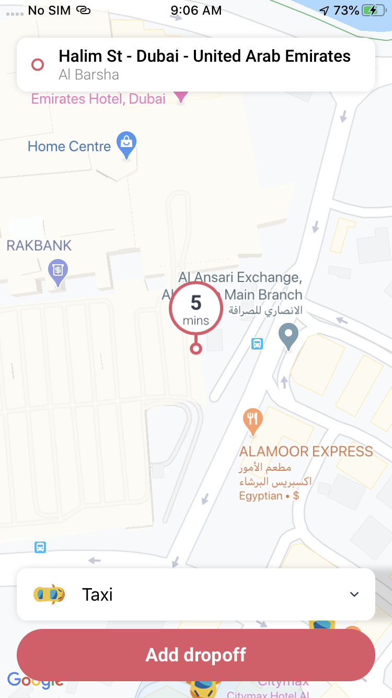

<p align="center">
  </center>
</p>

<h1> About </h1>
<p>
A Careem app clone using MVVM, RxSwift and Swinject.
</p>

<h1> Get it to work </h1>
<p>

 Add the key and host.  
 1-Add your google map key to ```Keys``` enum.  
 2-Add your host to the `Constants` enum. 
   
 You need to have 2 end points:  
 1- `/config.json` you can check the `Config` model for the structure.  
 2- `/cars.json` it's an array of cars, you can check the `Car` object for the structure.  
 
</p>

<h1> Screenshots </h1>
<table>
  <tbody>
    <tr>
      <th></th>
      <th></th>
      <th></th>
      <th></th>
    </tr>
  </tbody>
</table>
